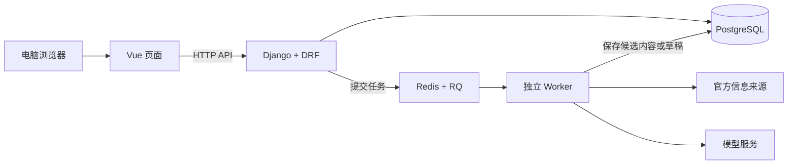

# 创享平台 · Chuangxiang Community

创享平台是国豪书院创新俱乐部发起的科创资讯与参赛组队网站，面向本校学生集中展示赛事、科研机会和快讯，并提供结构化招募与组队服务。

项目希望改善微信群中信息易被刷走、分类查找困难、招募信息分散和邀请新成员不便的问题。

**当前状态：工程初始化阶段，尚无可运行版本。以下功能为开发计划，技术组件将随对应模块逐步接入。**

## 服务范围

- 首期开发电脑端网页，在国豪书院试点，接受本校其他院系学生注册使用。
- 游客可查看资讯、快讯和不含联系方式的招募卡。
- 学生发布招募和提交申请前，需要完成学校邮箱验证。
- 学生组队仅用于参赛，招募必须关联平台已收录的赛事。
- 采用分类展示和固定招募模板，首期不设置开放式讨论区或站内聊天。

## 计划功能

| 模块 | 功能 |
| --- | --- |
| 资讯库 | 展示赛事与科研机会，支持筛选、收藏和排序，保留来源链接及更新时间 |
| 资讯同步 | 检查指定官方来源的更新，目标为每 6 小时一次，并支持手动触发；具体来源逐项验证接入能力 |
| 快讯 | 管理员按需触发草稿生成，确认后发布，不设固定周期 |
| 参赛组队 | 固定模板招募、申请加入、授权查看联系方式及双方确认入队 |
| 账号 | 注册、登录、学校邮箱验证和操作权限控制 |
| 资源中心 | 由管理员维护竞赛、科研相关资源 |
| 管理后台 | 内容维护、采集异常处理、举报核实与申诉处理 |

组队功能遵循以下规则：

- 同一队伍同时只保留一张有效招募卡。
- 队长接受申请后开放双方约定的联系方式，此时不占用招募名额。
- 双方确认正式入队后才占用名额，同一用户在同一赛事届次中只能正式加入一个队伍。
- 正式入队前可撤回申请；正式成员退出和移除按约定流程处理。
- 联系方式不包含在公开接口中。
- 平台内确认入队不等于完成赛事官方报名。

## 技术方案

Django 与 Django REST Framework 已确定。其余组件按当前设计基线逐步接入，具体版本在工程初始化时统一并锁定。

| 层次 | 技术 | 用途 |
| --- | --- | --- |
| 前端 | HTML、CSS、JavaScript、Vue 3 | 页面、组件与交互 |
| 前端工具 | Vite、Vue Router、Axios、Element Plus | 开发构建、路由、接口调用与通用界面组件 |
| 后端 | Python、Django、Django REST Framework | 接口、权限和业务流程 |
| 数据库 | PostgreSQL、Django ORM、Django migrations | 数据保存、关系约束与结构变更 |
| 账号与管理 | Django Auth、Session Cookie、django-allauth、Django Admin | 登录、邮箱验证与运营管理 |
| 后台任务 | RQ、Redis | 采集、邮件和 AI 等耗时任务，在对应模块开发时启用 |
| 资讯采集 | HTTPX、Beautiful Soup | 获取与解析可接入的官方来源 |
| 接口与测试 | drf-spectacular、pytest、pytest-django | 接口说明及权限、流程、并发一致性验证 |
| 部署 | Linux、Gunicorn、Nginx | 正式服务运行；开发电脑可使用 Windows |

邮件服务尚待选定。Docker Compose、Pinia、TypeScript 和 pgvector 根据实际需要另行决定。

## AI 规划

优先验证两项应用：

1. **通知字段提取：**从官方通知中提取参赛条件、报名截止、作品提交截止等内容，保存对应原文依据。
2. **快讯草稿生成：**根据已收录且仍有效的信息生成摘要与快讯草稿，由管理员确认后发布。

Qwen 托管 API 作为试用候选，最终模型依据实际通知样本的准确性、响应时间和费用评测决定。模型输出经过格式、原文依据和业务规则校验，不直接决定账号权限或入队结果。

自然语言赛事检索、队伍匹配和向量检索属于后续待评估扩展，尚未确定进入首版。

**赛事卡片模板由前端预先编写，已发布内容保存在数据库。普通列表读取已有数据，不等待 AI 生成卡片。** AI 服务异常时，应保留已有资讯浏览和基础组队能力。

## 系统结构

以下为计划架构，后台任务和模型服务随对应功能接入。



前端通过后端接口访问业务数据。数据库模型与迁移在同一个 Django 工程中维护。模型调用在服务端执行，密钥不发送到浏览器。

## 目录规划

当前仓库仅包含项目说明，以下目录在工程初始化及功能开发时建立。

```text
Chuangxiang-Community/
├── frontend/          # Vue 前端
├── backend/           # Django 后端，包含模型、迁移与业务代码
├── docs/              # 接口、数据字典和环境说明
├── .github/workflows/ # 后续配置自动检查
├── .gitignore
└── README.md
```

## 本地运行

目前可以克隆仓库：

```bash
git clone https://github.com/flx6662007/Chuangxiang-Community.git
cd Chuangxiang-Community
```

工程尚未初始化，暂时无法启动网站。首个可运行版本合并后，将补充并验证：

- 环境版本、依赖安装和配置示例。
- 数据库创建、迁移与虚构示例数据导入。
- 前后端启动命令、本地访问地址和接口说明。
- 测试与构建命令，以及启用后的后台任务启动方式。

计划通过开发代理及正式环境的统一站点入口连接前后端，使用 Session Cookie 时保留 CSRF 保护。

## 开发进度

- [x] 完成前端、后端与数据库技术调研。
- [x] 确定 Django 与 Django REST Framework。
- [ ] **第一轮：**初始化工程、模型与测试数据，跑通赛事列表接口和页面。
- [ ] **第二轮 A：**完成注册、登录和学校邮箱验证。
- [ ] **第二轮 B：**完成固定模板招募的发布与公开查看。
- [ ] 完成申请加入、联系方式授权、正式入队及退出流程。
- [ ] 完成资讯采集、AI 字段提取和快讯草稿生成。
- [ ] 完成资源与治理功能、关键测试和试点部署。

AI 可在第二轮并行开展小样本试验，试验结果不等于正式功能已上线。

## 维护与反馈

团队分别主负责前端界面、后端业务和数据建模，共同完成接口对接、测试及部署。功能建议和问题通过本仓库的 Issues 记录。

## 许可与第三方资源

项目许可证尚待团队确认。第三方软件、模型和素材的来源、版本及许可证将在引入时记录。仓库不提交真实学生资料、生产数据库备份、密码或服务密钥。
